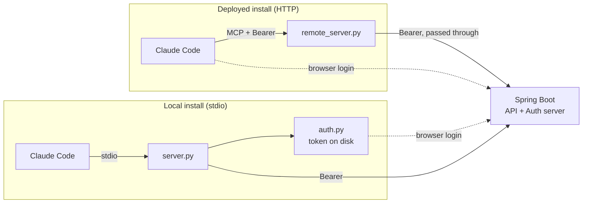
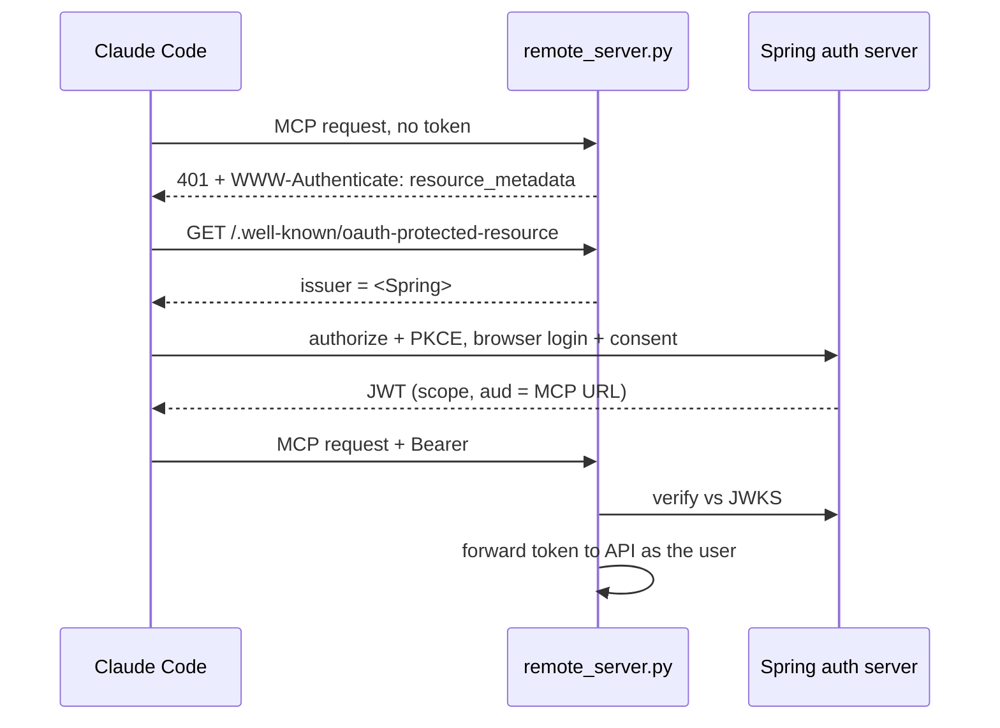
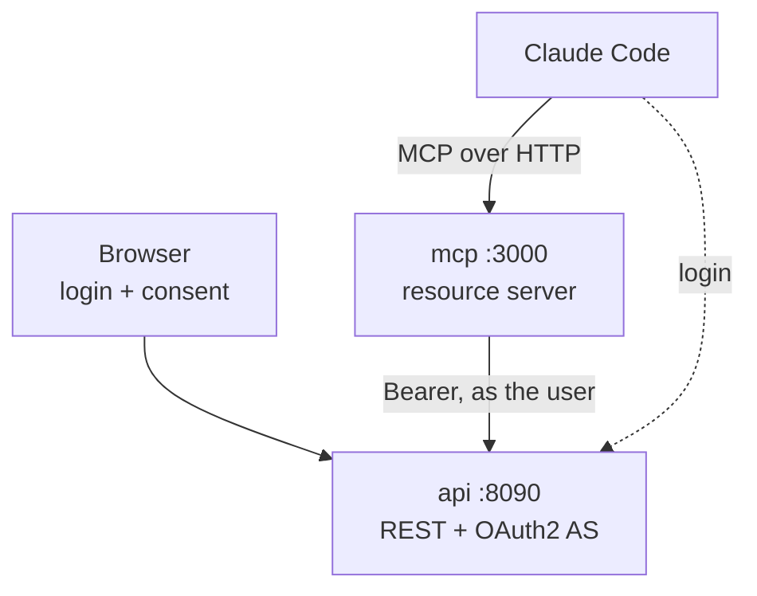

# Architecture

A Spring Boot product catalogue exposed to Claude Code as MCP tools, where every
tool call runs **as the signed-in user** rather than as the application.

One service, two front doors. The Spring app is both the REST API and the OAuth2
authorization server; the MCP layer ships in two transports over the same tool
code. Nothing in the MCP layer holds a credential of its own.

## Components

| Component | Path | Role |
| --- | --- | --- |
| Product API | `springboot/` | CRUD REST endpoints under `/api/products`, scope-guarded |
| Authorization server | `springboot/` (same app) | `/oauth2/authorize`, `/oauth2/token`, `/oauth2/jwks`, consent + login UI |
| Local MCP server | `mcp-server/server.py` | stdio transport; runs its own browser login, caches the token on disk |
| Remote MCP server | `mcp-server/remote_server.py` | streamable-HTTP transport; OAuth2 resource server, verifies the token Claude Code presents |
| Shared tools | `mcp-server/tools.py` | the six product tools, transport-agnostic |
| Browser login | `mcp-server/auth.py`, `login.py` | authorization code + PKCE against a loopback redirect |

`tools.py` is the reason both transports stay honest: the API calls exist once,
and `register_products(mcp, token_provider)` takes the *only* difference — where
the bearer token comes from — as a parameter.

## The two front doors

The split matters because **who runs the browser** differs:

- **stdio** — the server is on the user's machine, so it can open a browser
  itself. `auth.py` binds a loopback port, opens `/oauth2/authorize`, catches the
  redirect, exchanges the code, and caches tokens at `~/.crud-mcp/token.json`
  (mode `0600`).
- **remote** — the server is on a host with no browser and no user. It never logs
  anyone in. Claude Code discovers the authorization server through the protected
  resource metadata, runs login and consent itself, and presents the token on
  every MCP request.

## Remote auth handshake

## How a call is authorized

Authorization is enforced at the resource server on **one thing**: the JWT's
`scope` claim.

- `SecurityConfig` maps method to scope — `GET /api/**` needs
  `SCOPE_products.read`, and POST/PUT/DELETE need `SCOPE_products.write`.
- That is why a read-only consent produces a working `list_products` and a
  `403` on `delete_product`. The failure is by design, not a bug.

Three pieces make that claim trustworthy:

| Concern | Mechanism | Where |
| --- | --- | --- |
| A forged consent can't widen access | token scopes intersected with the user's own allowance | `UserScopeJwtCustomizer` |
| Write is a per-login decision | consent is deliberately never stored | `PerLoginConsentService` |
| A token for elsewhere can't be replayed here | `aud` stamped for the remote client, verified on arrival | `ResourceAudienceJwtCustomizer`, `SpringJwtVerifier` |

`UserScopeJwtCustomizer` is the load-bearing one. The consent screen only offers
scopes the user may hold, but a UI filter is not a security control — a
hand-crafted POST to `/oauth2/authorize` could approve anything the client is
registered for. Intersecting at mint time means bob's token comes back read-only
no matter what he approved.

`ResourceAudienceJwtCustomizer` exists because Spring Authorization Server does
not implement RFC 8707 resource indicators — it ignores the `resource` parameter
the client sends. Without the stamped `aud`, the MCP server would have nothing to
check, and any token from this issuer would work against it.

## Registered clients

| Client | Auth method | Grants | Used by |
| --- | --- | --- | --- |
| `crud-plugin` | none (public, PKCE required) | authorization_code | local stdio server |
| `crud-mcp-remote` | none (public, PKCE required) | authorization_code | Claude Code → remote server |
| `crud-client` | client secret | client_credentials, password | machine-to-machine |

Both MCP clients are public: they run where a secret would be readable, so PKCE
binds the code to the requesting process instead. Spring will not issue a refresh
token to a client that cannot authenticate, so the access token is long-lived
(8h) and the browser flow simply runs again when it lapses. The `refresh_token`
grant stays registered so promoting either client to confidential is a one-line
change.

Redirect URIs are a fixed range — `127.0.0.1:8765-8769/callback` for the plugin,
`localhost:8765-8769/callback` for Claude Code. RFC 8252 asks servers to allow
any loopback port, but Spring matches redirect URIs exactly, so the client binds
the first free port in the registered range.

## Deployment

Two containers, `docker compose up --build`. The MCP server cannot be deployed
alone — it has no one to verify tokens against.

`PUBLIC_API_URL` and `PUBLIC_MCP_URL` go into tokens (`iss`, `aud`) and into the
discovery documents, so they must be the real public URLs, not container names.
This is the usual source of a working local run that breaks behind a proxy.
Internal calls still use the compose network (`http://api:8080` for API traffic
and JWKS), because only the *advertised* identity has to be public.

## Known demo-grade edges

These are deliberate for a demo and would change in a real deployment:

- **Signing key is generated at startup** — every restart invalidates all issued
  tokens. `PyJWKClient` recovers by refetching on an unknown key id; clients see
  a one-off 401 and re-auth. A real deployment loads a persistent key.
- **In-memory stores** — H2 database, `InMemoryRegisteredClientRepository`,
  `InMemoryOAuth2AuthorizationService`. Nothing survives a restart.
- **Seeded demo users** — `alice` (read + write) and `bob` (read only), with
  known passwords, created on every start.
- **No token revocation** — signing out locally deletes the cached token but does
  not revoke it; it stays valid at the authorization server until it expires.
- **Password grant** — a custom grant kept for machine-to-machine convenience.
  It is deprecated in OAuth 2.1 and has no place in new work.
